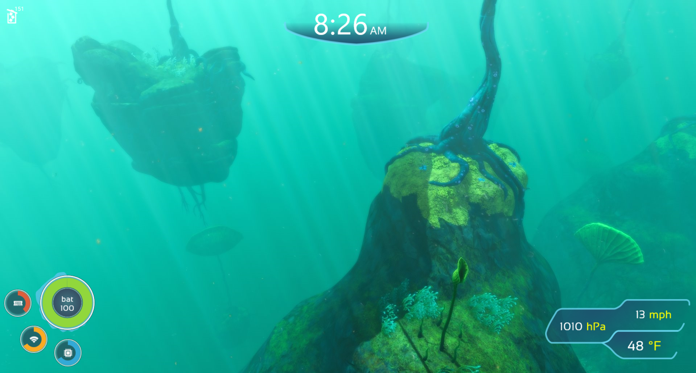

# Subnautica Rainmeter Theme
A Subnautica inspired Rainmeter theme. This is a remix of Circuitous Two (see CircuitousTwoReadme.rtf for licensing details). 

See [the releases page](https://github.com/kylecorry31/Subnautica-Rainmeter-Theme/releases) for the rmskin file.

## Credits
- [Remix of Circuitous Two](https://www.deviantart.com/flyinghyrax/art/CircuitousTwo-376652231)
- [Weather - Phenix](https://www.deviantart.com/dd-921/art/Phenix-1-2f-593485992)
- [Icons](https://www.flaticon.com/authors/freepik)
